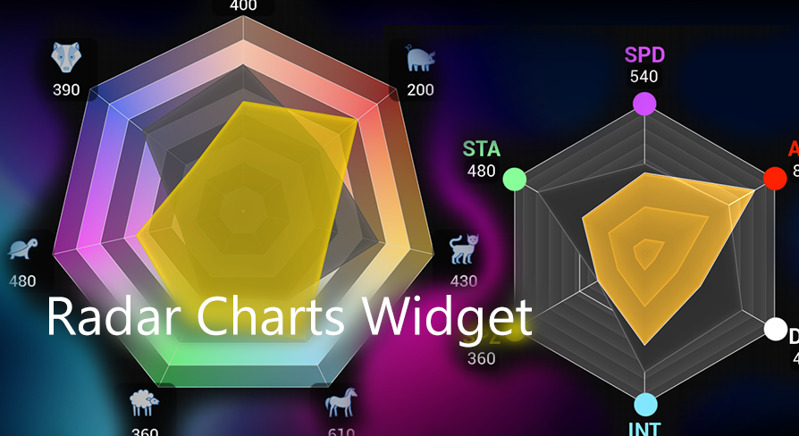

<h1>Radar Chart Widget</h1>
<body>

|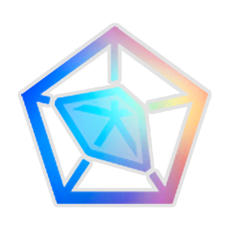| <h2> Documentation for the Radar Chart Widget Plugin for Unreal Engine </h2>|
|---|---|

Available at here : [Marketplace](https://unrealengine.com/marketplace/en-US/product/radar-chart-widget)

## Content 

* 1\. [Overview](#Overview)
    * 1.1\. [Designer Settings](#DesignerSettings)
        * 1.1.1\. [Chart](#Chart)
        * 1.1.2\. [Segments](#Segments)
        * 1.1.3\. [Cuts](#Cuts)
        * 1.1.4\. [Dividers](#Dividers)
        * 1.1.5\. [Label Settings](#LabelSettings)
        * 1.1.6\. [Values](#Values)
        * 1.1.7\. [Perfomance](#Perfomance)
    * 1.2\. [Functions](#Functions)
        * 1.2.1\. [Set Values](#SetValues)
        * 1.2.2\. [Invalidate Material](#InvalidateMaterial)
        * 1.2.3\. [Invalidate Panel](#InvalidatePanel)
    * 1.3\. [Types](#Types)
        * 1.3.1\. [Structs](#Structs)
            * 1.3.1.1 [FRadarChartAppearance](#FRadarChartAppearance)
            * 1.3.1.2 [FRadarChartColorOverride](#FRadarChartColorOverride)
            * 1.3.1.3 [FRadarChartValueData](#FRadarChartValueData)
            * 1.3.1.4 [FRadarChartSegment](#FRadarChartSegment)
        * 1.3.2\. [Enums](#Enums)
            * 1.3.2.1 [ERadarChartBlendMode](#ERadarChartBlendMode)
            * 1.3.2.2 [ERadarChartColorOverride](#ERadarChartColorOverride)
            * 1.3.2.3 [ERadarChartLabelBackgroundMethod](#ERadarChartLabelBackgroundMethod)
    * 1.4\. [Tips](#Tips)

# Overview

## DesignerSettings

Show Screenshot

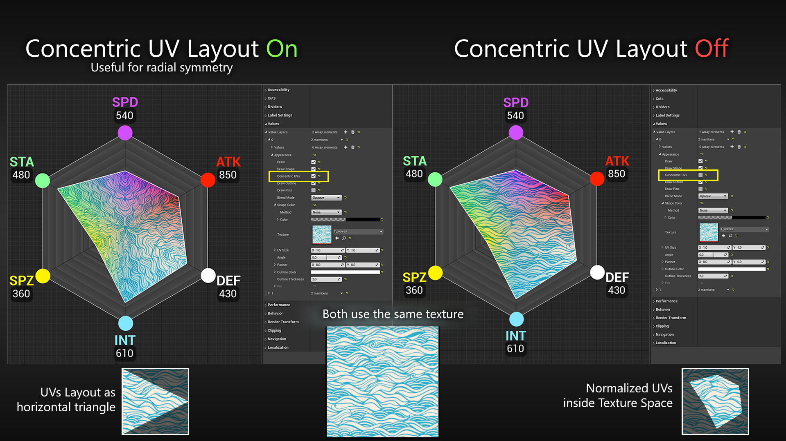

### Chart
|Type|Setting|Description|
|---|---|---|
|bool|Keep Aspect Ratio:|True = Force the Chart to keep aspect ratio, calculated by the smallest size.   False = Stretch to fill.|
|float|Scale:|Scale the Radius of the whole Shape. 2.f meaning the shape is the size of the clipping rect. Caution this does not respect the labels!|
|[FRadarChartAppearance](#FRadarChartAppearance)|Appearance:|Appearance Settings for the Base. See [FRadarChartAppearance](#FRadarChartAppearance).|

### Segments
|Type|Setting|Description|
|---|---|---|
|TArray<[FRadarChartSegment](#FRadarChartSegment)>|Segments|Array of Segments, at least 3 Segments are required to draw a triangular shape. See [FRadarChartSegment](#FRadarChartSegment).|

### Cuts
The Lines going from the center to the outline.
|Type|Setting|Description|
|---|---|---|
|bool|Draw Cuts:|Show/Hide the cuts.|
|FLinearColor|Cuts Color:|The Color of the Cuts.|
|float|Cuts Thickness:|How thick the cuts should be drawn. Default = 1.f, but sometimes you need to increase it to something greater, because of antialiasing glitches.|
|uint8 (byte)|Cuts ZOrder Offset:| Adjust the Z Order, 0 = draw underneath the shape, 1 = above, any higher to draw above Value Layers, etc. slider max = 32, typed in max = 255.

### Dividers
The Rings dividing the Cuts
|Type|Setting|Description|
|---|---|---|
|bool|Draw Dividers:|Show/Hide the Dividers.|
|FLinearColor|Dividers Color:|The Color of the Dividers.|
|uint8 (byte)|Dividers Count:|How many dividers should be drawn, min = 1, slider max = 16, typed in max = 32.
|float|Dividers Thickness:|How thick the dividers should be drawn. Default = 1.f, but sometimes you need to increase it to something greater, because of antialiasing glitches.|
|uint8 (byte)|Dividers ZOrder Offset:| Adjust the Z Order, 0 = draw underneath the shape, 1 = above, any higher to draw above Value Layers, etc. slider max = 32, typed in max = 255.

### Label Settings
|Type|Setting|Description|
|---|---|---|
|bool|Draw Icons:|Show/Hide the Icons.|
|bool|Draw Labels:|Show/Hide the Text Labels.|
|bool|Draw SubLabels:|Show/Hide the SubLabels.|
|bool|Draw Label Background:|Show/Hide the Background behind the labels.|
|float|Distance:|Distance from the outline vertex to the middle of the Text Label. 0 = The TextLabel is centered above the corner.|
|float|Vertical Offset:| Offset all Labels up/down to accumulate for Icons/SubLabel positions. Use this to reposition the Labels if the vetical spacing is undesired.|
|[FRadarChartColorOverride](#FRadarChartColorOverride)|Icon Color:|ColorCoding for the Icon. See [FRadarChartColorOverride](#FRadarChartColorOverride).|
|FVector2D|Icon Size:|Size of the Icon. Default = <32.0, 32.0>|
|FVector2D|Icon Offset:|Used to offset the Icon from the Label center. Default = <0.0, -32.0>|
|[FRadarChartColorOverride](#FRadarChartColorOverride)|Label Color:|ColorCoding for the Text Label. See [FRadarChartColorOverride](#FRadarChartColorOverride).|
|FSlateFontInfo|LabelFont:|Font Settings for the text Label.|
|[FRadarChartColorOverride](#FRadarChartColorOverride)|Label Color:|ColorCoding for the SubLabel Text. See [FRadarChartColorOverride](#FRadarChartColorOverride).|
|FSlateFontInfo|SubLabelFont:|Font Settings for the SubLabel text.|
|FVector2D|SubLabel Offset:|Used to offset the SubLabel from the Label center. Default = <0.0, 32.0>|
|FSlateBrush|Background:|Brush to use as background for the .|
|[ERadarChartLabelBackgroundMethod](#ERadarChartLabelBackgroundMethod)|Background Wrap Method:|Which Wrapping policy to use. See [ERadarChartLabelBackgroundMethod](#ERadarChartLabelBackgroundMethod).|
|FVector2D|Background Padding:|Space between the background and chosen source.|
|FVector2D|Background Offset:|Offset of the background, only available when Method set to "Custom".|

### Values
|Type|Setting|Description|
|---|---|---|
|TArray<[FRadarChartValueData](#FRadarChartValueData)>|ValueLayers| Array of Value Data (Array of floats + [FRadarChartAppearance](FRadarChartAppearance)). Currently limited to a maximum of 4.  See [FRadarChartValueData](#FRadarChartValueData).|

### Perfomance
|Type|Setting|Description|
|---|---|---|
|bool|Wrap with Invalidation Panel|[Recommended] Wrap the Chart inside an SInvalidationPanel, so it gets cached. Saves performance drastically! But needs to be invalidated if the Chart gets modified. See [Invalidate Panel](#InvalidatePanel)|

> Note: You can see the perfomance impact by using the command line ***"STAT RadarChart"***.
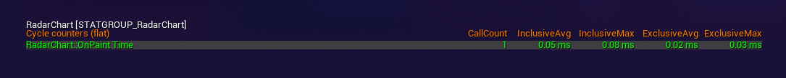

>If [Wrap with Invalidation Panel](#Perfomance) ist set to true, the OnPaint is called only on the first couple frames (or when Invalidated manually), and then gets cached. If the "RadarChart::OnPaint Time" is not shown, all visible Charts are cached.
And you can see the perfomance impact with ***"STAT Slate"***. Look for ***"SInvalidationPanel::Paint"*** (But this is affected by all visible widgets inside an Invalidation Panel).
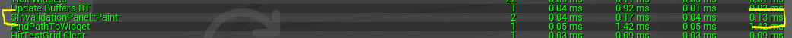

# Functions
## Set Values
Value Layer Index = Index of the Value Layers, mostly 0 if you have just a single layer.
  Value Index = Index of the float array you want to modify.

|Function|Name|Description|
|---|---|---|
|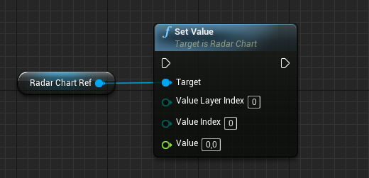|Set Value|Use this function if just a single value needs to be updated. The wanted Value Layer must already exist.  The wanted Value must already exist.|
|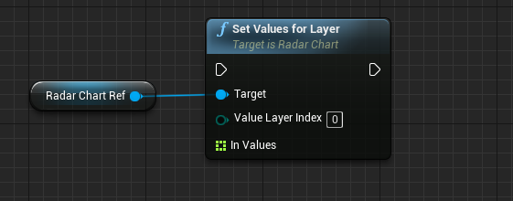|Set Values for Layer|Use this function to update all values for a specific layer at once.  This funciton takes in an array of raw floats. The Values array must be the same size as the segments! The wanted Value Layer must already exist.|
|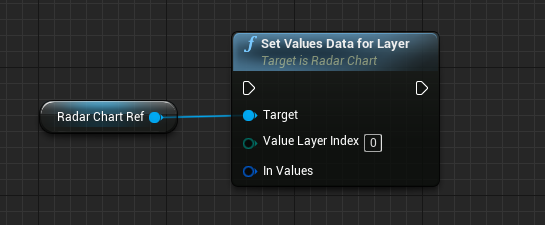|Set Values Data for Layer|Use this function if you want to set the values AND appearance for a specific layer.  This functions takes in an array of [FRadarChartValueData](#FRadarChartValueData). The wanted Value Layer must already exist.|
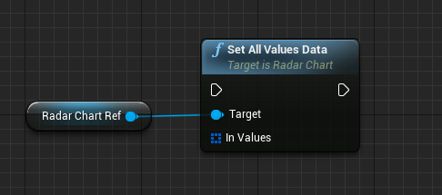|Set All Values Data| Use this Function to overwrite the whole ValueLayers data.|

## Invalidate Material
If you change the Texture and/or the BlendMode of any appearance, you must invalidate the Material, to take effect.

|Function|Name|Description|
|---|---|---|
|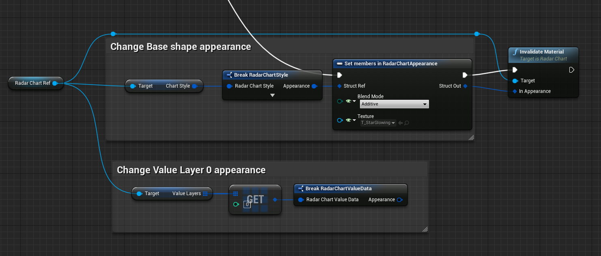|Invalidate Material|This fuction is used if you want to change the texture or the BlendMode of a single Appearance. This function takes in a [FRadarChartAppearance](FRadarChartAppearance), only it's material get invalidated. Call it after the changes.|
|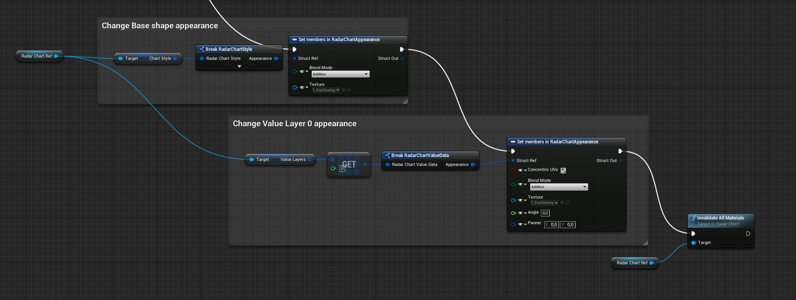|Invalidate All Materials|This fuction is used if you want to change the texture or the BlendMode multiple Appearances. This function has no inputs, because it updates the materials in all available Appearances (Base and Values).  Call it after the changes.|

## Invalidate Panel
If [Wrap with Invalidation Panel](#Perfomance) is set to true, you must invalidate the Panel after you made ANY changes, or it won't take any effect. Because the whole Chart is cached, and it's OnPaint function is not called. Avoid calling it multiple times consecutively.
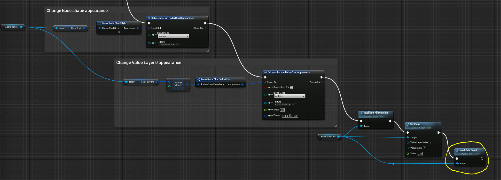

## Types
### Structs
#### FRadarChartAppearance
|Type|Name|Description
|---|---|---|
|bool|Draw:|Show/Hide the complete Shape Layer, including the Outline and Pins.|
|bool|Draw Shape:|Show/Hide the Shape.|
|bool|[Concentric UVs:](#bConcentricUVs)|True: The UVs are layed out pointing towards the center, making it easy to create radial symmetry.  False: The UVs are layed out normally.|
|bool|Draw Outline:|Show/Hide the outline|
|bool|Draw Pins:|Show/Hide the Pins.|
|[ERadarChartBlendMode](#ERadarChartBlendMode)|BlendMode:|Set the BlendMode of the used Material. See [ERadarChartBlendMode](#ERadarChartBlendMode)|
|[FRadarChartColorOverride](#FRadarChartColorOverride)|Shape Color:|ColorCoding for the Chart Shape. See [FRadarChartColorOverride](#FRadarChartColorOverride).|
|UTexture2D*|Texture:|Texture to use for the Shape material.|
|FVector2D|UV Size:| UVs for the Texture.|
|float|Angle:|Rotation of the Texture.|
|FVector2D|UV Size:| UVs for the Texture.|
|FLinearColor|OutlineColor:|Color for the Outline. Using the Outline is recommended to hide the missing antialiasing from the shape edges.|
|float|Outline Thickness:|Thickness for the Outline. Default = 1.f, but sometimes you need to increase it to something greater, because of antialiasing glitches.|
|[FRadarChartPin](#FRadarChartPin)|Pin:| Style for the Pins. Pins are Images/Materials drawn on the corners of the shape.|

#### Concentric UVs Usage

Show Screenshot:

#### FRadarChartColorOverride
|Type|Name|Description
|---|---|---|
|[ERadarChartColorOverride](#ERadarChartColorOverride)|Method| Method used to modify the segment color with. See [ERadarChartColorOverride](#ERadarChartColorOverride)|
|FLinearColor|Color|The color to use for the manipulation|

#### FRadarChartPin
|Type|Name|Description
|---|---|---|
|UObject*|Icon:|Icon to use as Pin, can be a Texture or Material (Domain must be UI!)|
|FVector2D|Size:|Size of the Pin. Default = <32.0, 32.0>|
|[FRadarChartColorOverride](#FRadarChartColorOverride)|Color:|ColorCoding for the Pin. See [FRadarChartColorOverride](#FRadarChartColorOverride).|
|float|Distance:|Distance offset from the corners. Negative goes towards the center, and positive values in the opposite direction.
|float|Angle:| Rotate the Icon, in Degrees.|
|uint8 (byte)|ZOrder Offset:| Adjust the Z Order, 0 = draw underneath the shape, 1 = above, any higher to draw above Value Layers, etc. slider max = 32, typed in max = 255.

#### FRadarChartValueData
|Type|Name|Description
|---|---|---|
|TArray<float>|Values:|Array of floats, amount must be equal to the segment array size. Values are normalized (0.0 - 1.0).|
|[FRadarChartAppearance](#FRadarChartAppearance)|Appearance:|Appearance for this Layer. See [FRadarChartAppearance](#FRadarChartAppearance)|

#### FRadarChartSegment
|Type|Name|Description
|---|---|---|
|FLinearColor|Color:|Color for current segment, useful for color coding all related information (Icon, Label, SubLabel, Pins, ...)|
|UObject*|Icon:|Icon for the current segment, can be a Texture or Material (Domain must be UI!)|
|FText|Label:|Text Label for the current segment, example:"ATK".|
|FText|SubLabel:|Usually set to the current value.|
|FVector2D|Offset:|Additional offset to adjust the position of the Icon, Label, SubLabel and Label Background for this segment only, at once.|

### Enums
#### ERadarChartBlendMode
|Name|Description|
|---|---|
|Opaque:| Set the Material to Opaque, Render Opacity is not supported. Best perfomance, less overdraw.|
|Translucent:| Set the Material to Translucent, Render Opacity is supported. Use final Alpha defined by color as opacity.|
|Additive:| Set the Material to Additive, adds it's color to the underlaying Pixels.|

#### ERadarChartColorOverride
|Name|Description|
|---|---|
|None:|Do not override, use the color set inside the segment.|
|Multiply:|Multiply the color with the segment color.|
|Overwrite:|Use this color instead of the segment color.|
|OverwriteAlphaOnly:|Use the segment color and the alpha of this one.|
|OverwriteHue:|Multiply the luminance of the segment color with the this color's Hue.|
|OverwriteHueAndAlpha:|Same as OverwriteHue but include Alpha.|
|Desaturate:|Desaturate the segment colorby the luminance of this color.|
|DesaturateAndAlpha:|Same as Desaturate but include Alpha.|

#### ERadarChartLabelBackgroundMethod
|Name|Description|
|---|---|
|Label:|Wrap around the text Label.|
|SubLabel:|Wrap around the SubLabel text.|
|Icon:|Wrap around the icon.|
|Custom:|Use Padding as Background Padding as size instead.|

## Tips
If you want the Brushes (Pins & Icons) to resize uniformly with the chart you need to parent the chart inside a size box and this inside a scale box.
Otherwise all Pins & Icons will stay a their specified PixelSize * DPI;

Show Example

|||
|---|---|
|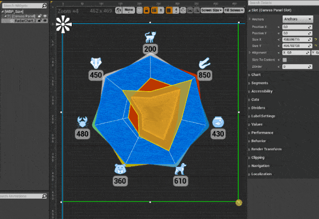|No SizeBox & ScaleBox, unwanted scaling behaviour.|
|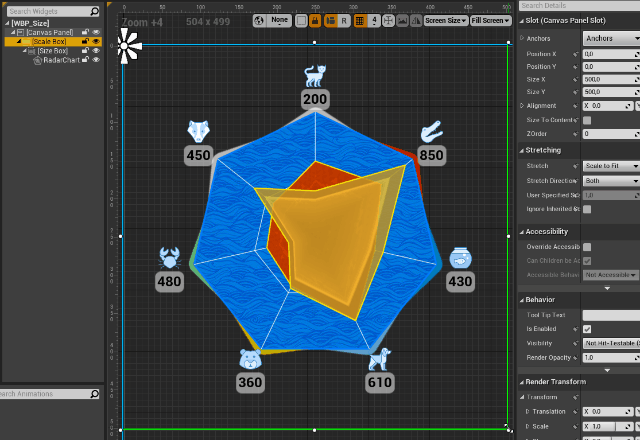|Hierarchy: -ScaleBox &nbsp;&nbsp;&nbsp;&nbsp;-SizeBox &nbsp;&nbsp;&nbsp;&nbsp;&nbsp;&nbsp;&nbsp;&nbsp;</bre>-RadarChart|

 For this example the SizeBox is set to Height & Width Override: 500

</body>
