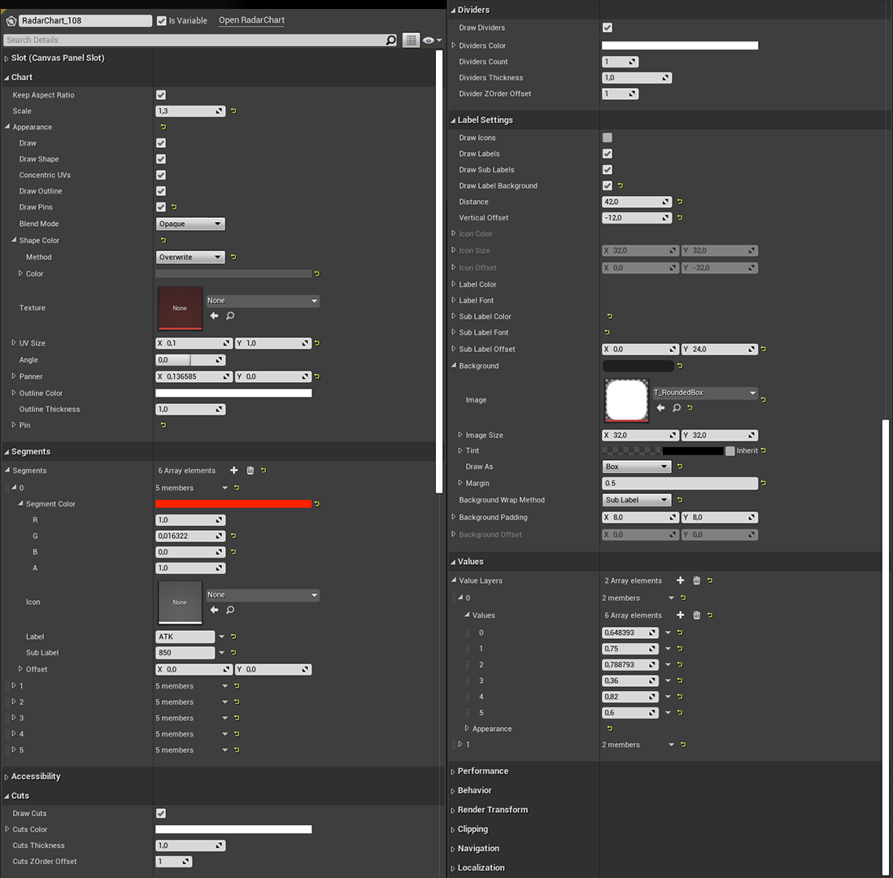

# Radar Chart Widget 
Documentation
Documentation for the Radar Chart Widget (Unreal Engine) Plugin
Available at the Marketplace: [will follow soon]

Overview

+ 

    
Designer Settings

    

    + 

        
Chart

        |Setting|Description|
        |---|---|
        |Keep Aspect Ratio:|True = Force the Chart to keep aspect ratio, calculated by the smallest size.   False = Stretch to fill.|
        |Scale:|Scale the Radius of the whole Shape. 2.f meaning the shape is the size of the clipping rect. Caution this does not respect the labels!|
        |Appearance:|Appearance Settings for the Base. See [FRadarChartAppearance](#FRadarChartAppearance)|

    

## Structs
+ 

    ### FRadarChartAppearance
    |Setting|Description|
    |---|---|
    |bDraw:|Show/Hide the complete Shape Layer, including the Outline and Pins. |
    |Scale: | Scale the Radius of the whole Shape. 2.f meaning the shape is the size of the clipping rect. Caution this does not respect the labels!|
    |Appearance: |Appearance Settings for the Base. See FRadarChartAppearance Struct|

    ### FRadarChartSegment
    

    |Setting|Description|
    |---|---|
    |Keep Aspect Ratio:|True = Force the Chart to keep aspect ratio, calculated by the smallest size.   False =Stretch to fill.|
    |Scale: | Scale the Radius of the whole Shape. 2.f meaning the shape is the size of the clipping rect. Caution this does not respect the labels!|
    |Appearance: |Appearance Settings for the Base. See FRadarChartAppearance Struct|

## Usage

## Tips

