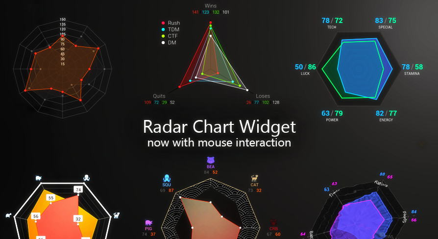

<h1>Radar Chart Widget</h1>
<body>

|| <h2> Documentation for the Radar Chart Widget Plugin for Unreal Engine </h2>|
|--|--|

The Plugin is available here : [Marketplace](https://unrealengine.com/marketplace/en-US/product/radar-chart-widget)
 
 
If you are looking for the Documentation for the old plugin (v2.x): [Deprecated Documentation](https://github.com/pDunkl/RadarChartWidgetDocumentation/tree/Deprecated)  
 
 
# Overview
* 1\. [UMG Designer Settings](#Designer-Settings)
* 2\. [Functions](#Functions)
* 3\. [Structs](#Structs)

Show List

    * 3.1 [FRadarChartStyle](#FRadarChartStyle)
        * 3.1.1 [Base](#Base)
        * 3.1.2 [Cuts](#Cuts)
        * 3.1.3 [Dividers](#Dividers)
        * 3.1.4 [Ruler](#Ruler)
        * 3.1.5 [Label](#Label)
        * 3.1.6 [Performance](#Performance)
        * 3.1.7 [Misc](#Misc)
    * 3.2 [FRadarChartAppearance](#FRadarChartAppearance)
    * 3.3 [FRadarChartColorOverride](#FRadarChartColorOverride)
    * 3.4 [FRadarChartButtonInteraction](#FRadarChartButtonInteraction)
    * 3.5 [FRadarChartButtonStyle](#FRadarChartButtonStyle)
    * 3.6 [FRadarChartSegmentLayout](#FRadarChartSegmentLayout)
    * 3.7 [FRadarChartSegment](#FRadarChartSegment)
    * 3.8 [FRadarChartValueText](#FRadarChartValueText)
    * 3.9 [FRadarChartValueLayer](#FRadarChartValueLayer)
    * 3.10 [FRadarChartEvent](#FRadarChartEvent)
    

* 4\. [Enums](#Enums)

Show List

    * 4.1 [ERadarChartValueDisplay](#ERadarChartValueDisplay)
    * 4.2 [ERadarChartColorOverride](#ERadarChartColorOverride)
    * 4.3 [ERadarChartBlendMode](#ERadarChartBlendMode)
    * 4.4 [ERadarChartEventSource](#ERadarChartEventSource)
    

* 5\. [Command](#Command)

# Designer Settings

Show Settings

|Type|Setting|Description|
|--|--|--|
|[FRadarChartStyle](#FRadarChartStyle)|Style:| Shows only inner properties in the editor Style Settings for the chart. See [FRadarChartStyle](#FRadarChartStyle)|
|TArray<[FRadarChartValueLayer](#FRadarChartValueLayer)>|ValueLayers:|The containing value layers. See [FRadarChartValueLayer](#FRadarChartValueLayer)|
|bool|Wrap With Invalidation Panel:|Wrap the chart within a Invalidation Panel to save performance [Recommended]|

# Functions

Show Functions

|Name|Description|
|--|--|
|Set Value|Update just one Value|
|Set Values For Layer|Update all values for a Layer|
|Set Values Animated (Async)|Update all values for a Layer but as smooth transition |
|Set Normalization Scale| Change the Normalization Scale, usefull if the chart should readjust to the newest maximum value or another criteria|
|Set Normalization Scale Animated (Async)| Change the Normalization Scale with a smooth transition|
|Force Rebuild|Force to fully rebuild the Chart, this is a expensive operation, as all Widgets get destroyed, recreated and layouted. Do not use in Tick or similar|
|Refresh| |Update Visuals which get cached after creation like Font Size, Text, Pins, etc. Many settings do not need a refresh after a change, like Cuts, Dividers, Shape Color, because they are never cached Best practice is, that when you make a change in realtime, check if it works without calling Refresh and only call it if not|
|Refresh Base||Same as Refresh but only for settings for the base|
|Refresh Value Layers||Same as Refresh but only for the Value layers|
|InvalidateMaterial|FRadarChartAppearance&|If you change the Texture and/or the BlendMode of any appearance, you must invalidate the Material, for the change to take effect Because a new Dynamic Material Instance needs to be created   Only update provided Appearance|
|InvalidateAllMaterials||Same as InvalidateMaterial, but for all Appearances (Base + Value Layers)|

# Structs
## FRadarChartStyle
### Base
|Type|Setting|Description|
|--|--|--|
|float|Normalization Scale:|The scale the values get normalized to|
|float|Chart Radius:|The Radius of the Chart Base|
|float|Start Angle:|Rotate the whole Chart| 
|[FRadarChartAppearance](#FRadarChartAppearance)>|Appearance|Base shape appearance settings. See [FRadarChartAppearance](#FRadarChartAppearance)|
|TArray<[FRadarChartSegment](#FRadarChartSegment)>|Segments|Array of Segments, at least 3 Segments are required to draw a triangular shape. See [FRadarChartSegment](#FRadarChartSegment)|

### Cuts
The Lines going from the center to the outline.
|Type|Setting|Description|
|--|--|--|
|bool|Show Cuts:|Show/Hide the cuts|
|FLinearColor|Cuts Color:|The Color of the Cuts|
|float|Cuts Thickness:|How thick the cuts should be drawn. Default = 1.f|
|int32|Cuts ZOrder Offset:| Adjust the Z Order Min = -2, Max = 9|

### Dividers
The Rings dividing the Cuts
|Type|Setting|Description|
|--|--|--|
|uint8 (byte)|Dividers Count:|How many dividers should be drawn 0 = off, 1, slider max = 24, typed in max = 128|
|FLinearColor|Dividers Color:|The Color of the Dividers|
|float|Dividers Thickness:|How thick the dividers should be drawn. Default = 1.f|
|int32|Dividers ZOrder Offset:| Adjust the Z Order Min = -2, Max = 9|

### Ruler
Units from center to the outer ring, giving information about the scale.  
Center = 0, Outer Ring = Normalization Scale value
|Type|Setting|Description|
|--|--|--|
|uint8 (byte)|Units:|How many units should be drawn. 0 = off, 1, slider max = 24, typed in max = 128.|
|uint8 (byte)|Show Every N Unit:|1 = Show every unit, 2 = show every second unit, and so on. Slider max = 24, typed in max = 128.|
|uint8 (byte)|Units Source Segment:|Along which segment the units should be drawn. Slider max = 32, typed in max = 128.|
|bool|Position Units between Cuts:|Should we center the ruler between two cuts?|
|FSlateFontInfo|Units Font:|Font to use|
|FLinearColor|Units Color:|The Color of the Units|
|uint8|UnitsDecimalPlaces:| 0 = Show as integer, >0 = show that many decimal places|
|EHorizontalAlignment|Units Alignment:|Alignment of the cuts relativ to the cut|
|FVector2D|UnitsOffset:|For adjusting the position|
|int32|Units ZOrder Offset:| Adjust the Z Order. Min = -2, Max = 9|

### Label
|Type|Setting|Description|
|--|--|--|
|FRadarChartButtonStyle|Label Button:|If at least one Label element is drawn, wrap it inside an button. (Icon, NameLabel or an ValueLayer label set to Display normal) See [FRadarChartButtonStyle](#FRadarChartButtonStyle)|
|bool|Show Icons:|Show the segment icons, if set|
|[FRadarChartColorOverride](#FRadarChartColorOverride)|Icon Color:|ColorCoding for the Icon. See [FRadarChartColorOverride](#FRadarChartColorOverride)|
|FVector2D|Icon Size:|Size of the Icon. Default = <24.0, 24.0>|
|bool|Show Name Label:|Show the name of the segment, if not empty|
|[FRadarChartColorOverride](#FRadarChartColorOverride)|Name Color:|ColorCoding for the Name Label. See [FRadarChartColorOverride](#FRadarChartColorOverride)|
|FSlateFontInfo|Name Font:|Font Settings for the Name Label|
|FSlateFontInfo|Values Font:|Font Settings for the Value Labels|
|FSlateBrush| Value Seperator:| Separator for all Value Labels, which are set to Display normal|
|EOrientation|Value Label Orientation:|Show the Value Labels in a Horizontal Box or in a Vertical Box|
|bool|Always Upright Icon:| Should the Icons always be upright|
|bool|Always Upright Name:| Should the Name always be upright|
|[FRadarChartSegmentLayout](#FRadarChartSegmentLayout)| Default Layout:|The default Layout of the Icons/Name/Values inside the Label Button. Each Segment has the possibility to override it with a custom Layout|
|FVector2D|Icon Padding||
|FVector2D|Name Padding||
|FVector2D|Value Label Container Padding:|Padding around the Box which contains the Value Labels|
|FVector2D|Separator Padding||
|float| Auto Flip Aligned:|The percent at which Icons/Name/Values get flipped, to be better readable going from top to bottom. 0 = non are flipped, >0.5 = everything under the center gets flipped, 1 = everything is flipped|
|float|Min Name Width:| Min Desired width for the name Label, if Simple Text Mode is true, the text might be offcenter|
|float|Min Values Width:| Min Desired width for the name Label, if Simple Text Mode is true, the text might be offcenter|
|uint8|Value Label Decimal Places:| 0 = Show as integer, >0 = show that many decimal places|

### Performance
|Type|Setting|Description|
|--|--|--|
|bool|Use Simple Text Mode:| Skip more expensive Text Layouting and safe performance, usually only needed if Min Width is set|

### Misc
|Type|Setting|Description|
|--|--|--|
|bool|Nested Label Hover Fix:| Use this if you have hoverable Value Label Buttons inside a hoverable Label Button. Because Unreal does not natively support nested Buttons to fire the OnHover event|

### Values
|Type|Setting|Description|
|--|--|--|
|TArray<[FRadarChartValueLayer](#FRadarChartValueLayer)>|ValueLayers| Array of Value Data (Array of floats + [FRadarChartAppearance](FRadarChartAppearance)). Currently limited to a maximum of 4.  See [FRadarChartValueLayer](#FRadarChartValueLayer)|

## FRadarChartAppearance
|Type|Name|Description
|--|--|--|
|bool|Show Shape:|Show/Hide the Shape|
|bool|[Concentric UVs:](#bConcentricUVs)|True: The UVs are layed out pointing towards the center, making it easy to create radial symmetry.  False: The UVs are layed out normally|
|bool|Show Outline:|Show/Hide the outline|
|bool|Show Pins:|Show/Hide the Pins|
|[ERadarChartBlendMode](#ERadarChartBlendMode)|BlendMode:|Set the BlendMode of the used Material. See [ERadarChartBlendMode](#ERadarChartBlendMode)|
|bool|Multiply Texture Alpha:| Only When BlendMode is Set to Translucent or Additive|
|[FRadarChartColorOverride](#FRadarChartColorOverride)|Shape Color:|ColorCoding for the Chart Shape. See [FRadarChartColorOverride](#FRadarChartColorOverride)|
|UTexture2D*|ShapeTexture:|Texture to use for the Shape material|
|FVector2D|Texture Size:| Scale of the Texture|
|float|Angle:|Rotation of the Texture|
|FVector2D|Panner:| Pan the Texture|
|FLinearColor|OutlineColor:|Color for the Outline. Using the Outline is always recommended to hide the missing antialiasing from the shape edges|
|float|Outline Thickness:|Thickness for the Outline. Default = 1.f, but sometimes you need to increase it to something greater, because of antialiasing glitches.|
|[FRadarChartButtonStyle](#FRadarChartButtonStyle)|Pin:| Style for the Pins. Pins are drawn on the corners of the shape. See [FRadarChartButtonStyle](#FRadarChartButtonStyle)|

## FRadarChartColorOverride
|Type|Name|Description
|--|--|--|
|[ERadarChartColorOverride](#ERadarChartColorOverride)|Method| Method used to modify the segment color with. See [ERadarChartColorOverride](#ERadarChartColorOverride)|
|FLinearColor|Color|The color to use for the manipulation|

## FRadarChartButtonInteraction
|Type|Name|Description
|--|--|--|
|bool|Hoverable|Is this Button able to fire the OnHover & OnUnhover events|
|bool|Pressable|Is this Button able to fire the OnPress & OnRelease events|
|bool|Clickable|Is this Button able to fire the OnClick|
|EButtonClickMethod|Click Method||
|EButtonTouchMethod|Touch Method||
|EButtonPressMethod|Press Method||

## FRadarChartButtonStyle
Derived from FButtonStyle

|Type|Name|Description
|--|--|--|
|[FRadarChartColorOverride](#FRadarChartColorOverride)|Color:|ColorCoding for the Button. See [FRadarChartColorOverride](#FRadarChartColorOverride)|
|float|Distance:|Distance offset from the corners. Negative goes towards the center, and positive values in the opposite direction
|float|Angle:| Rotate the Button, in Degrees|
|bool|Align:|Align this Button to be oriented towards the center of the chart|
|[FRadarChartButtonInteraction](#FRadarChartButtonInteraction)|Interaction:|Which interaction Events is this Button able to fire|
|int32|ZOrder Offset:| Adjust the Z Order. Min = -2, Max = 9|

## FRadarChartSegmentLayout
Layout used for the Label, like with GridPanels. 
ColumnRow, x = Column, y = Row Parameter.
|Type|Name|
|--|--|
|FIntPoin|Icon Column Row|
|FIntPoin|Name Label Column Row|
|FIntPoin|Value Label Column Row|

## FRadarChartSegment
|Type|Name|Description
|--|--|--|
|FLinearColor|Color:|Color for current segment, useful for color coding all related information (Icon, Label, SubLabel, Pins, ...)|
|UObject*|Icon:|Icon for the current segment, can be a Texture or Material (Domain must be UI!)|
|FText|Label:|Text Label for the current segment, example:"ATK".|
|FText|SubLabel:|Usually set to the current value.|
|FVector2D|Offset:|Additional offset to adjust the position of the Icon, Label, SubLabel and Label Background for this segment only, at once.|

## FRadarChartValueText
|Type|Name|Description
|--|--|--|
|[ERadarChartValueDisplay](#ERadarChartValueDisplay)|DisplayMode:|Show/Hide Values, with two different modes. See [ERadarChartValueDisplay](#ERadarChartValueDisplay)|
|[FRadarChartColorOverride](#FRadarChartColorOverride)|Color:|ColorCoding for the Value Text|
|FVector2D|Offset:|Adjust the position of all Values, only available if DisplayMode is set to snap|
|[FRadarChartButtonStyle](#FRadarChartButtonStyle)|Button:|The Button Style to use with possibility of interaction. See [FRadarChartButtonStyle](#FRadarChartButtonStyle)|
|bool|Always Upright Value:|The Values will always be upright, even if the button is set to aligned|
|bool|Flip Text When Aligned:|Usefull if the Button is rotated 180 degrees for design purposes|

## FRadarChartValueLayer
|Type|Name|Description
|--|--|--|
|TArray<float>|Raw Values:|Array of floats, amount must be equal to the segment array size|
|[FRadarChartAppearance](#FRadarChartAppearance)|Appearance:|Appearance for this Layer. See [FRadarChartAppearance](#FRadarChartAppearance)|
|[FRadarChartValueText](#FRadarChartValueText)| Text Settings:|Value Label Text Settings. See [FRadarChartValueText](#FRadarChartValueText)|
|bool| Enable Pin Sliding:| Needs "Show Pins" be enabled inside "Appearance". Enable modifying the Values by dragging the Pin of the layer|
|float| Pin Sliding Steps:| 0 = No stepping|

## FRadarChartEvent
|Type|Name|Description|
|--|--|--|
|[ERadarChartEventSource](#ERadarChartEventSource)|Source:|What Source caused this event. See [ERadarChartEventSource](#ERadarChartEventSource)|
|uint8 (byte)|Value Layer Index:| Which Value Layer, if the source was from the value layers (if source was from the base, it will be 0 too!)|
|uint8| Value Index:| Index of the segment|
|FVector2D|Screen Space Position:|Where the source is located on the screen, usefull for tooltips and similar|

# Enums
## ERadarChartValueDisplay
|Name|Description|
|--|--|
|Disabled|Do not draw values|
|Normal|Show the values at the label|
|Snap|Show the values snapped on their positions at the shape

## ERadarChartColorOverride
|Name|Description|
|--|--|
|None:|Do not override, use the color set inside the segment.|
|Multiply:|Multiply the color with the segment color.|
|Override:|Use this color instead of the segment color.|
|OverrideAlphaOnly:|Use the segment color and the alpha of this one.|
|OverrideHue:|Multiply the luminance of the segment color with the this color's Hue.|
|OverrideHueAndAlpha:|Same as OverrideHue but include Alpha.|
|Desaturate:|Desaturate the segment colorby the luminance of this color.|
|DesaturateAndAlpha:|Same as Desaturate but include Alpha.|

## ERadarChartBlendMode
|Name|Description|
|--|--|
|Opaque:| Set the Material to Opaque, Render Opacity is not supported. Best perfomance, less overdraw.|
|Translucent:| Set the Material to Translucent, Render Opacity is supported. Use final Alpha defined by color as opacity.|
|Additive:| Set the Material to Additive, adds it's color to the underlaying Pixels.|

## ERadarChartEventSource
|Name|
|--|--|
|Base Label|
|Base Pin|
|Value Label|
|Value Pin|

# Command
You can see the perfomance impact by using the command line
 ***"STAT RadarChart"***.

* **"RadarChart::OnPaint Time"**: The time to draw the widgets, if it is not shown, all visible Charts are cached.
And you can see the perfomance impact with ***"STAT Slate"***. Look for ***"SInvalidationPanel::Paint"*** (But this is affected by all visible widgets inside an Invalidation Panel).

>Note: If "Wrap with Invalidation Panel" ist set to true, the OnPaint is called only on the first couple frames (or when Invalidated manually), and then gets cached.

* **"RadarChart::Construct Time"**: is only called on construct or when "Force Rebuild" is called. This shows the time creating all the containing sub widgets and layouting

</body>
